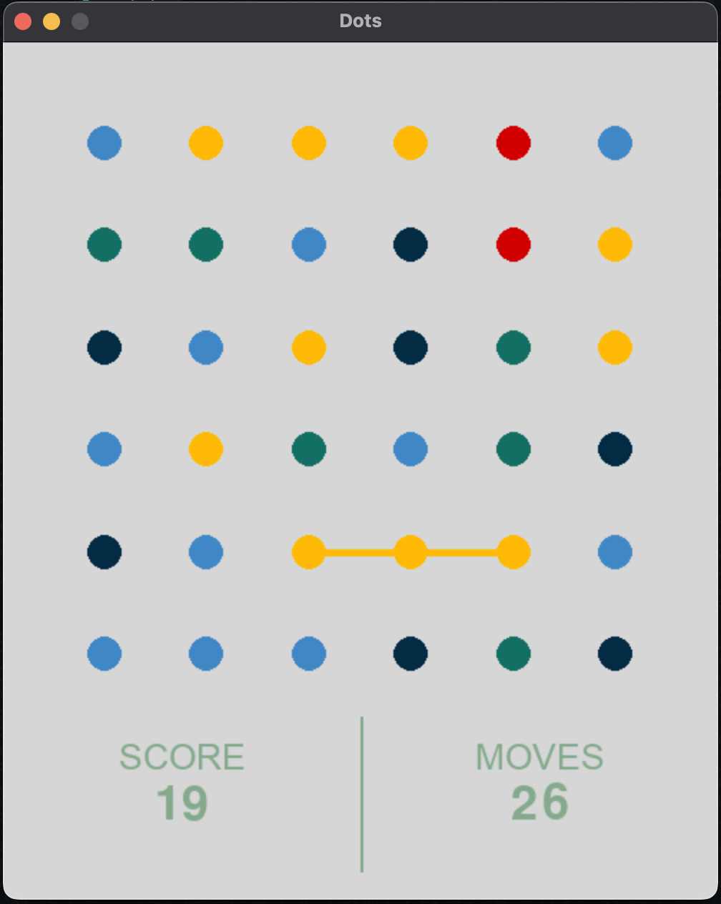
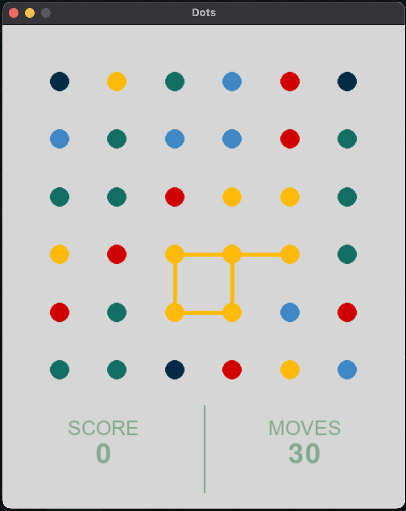

# Dots!

## Intro

This is an environment and pygame playable game that emulates the Dots app on Android and Iphone. The idea was to
develop an environment mimicking gym environments (from OpenAI) in order to teach an RL agent how to play the game.

## The Game

In order to play the game the app/dots.py file must be run, it will render a pygame window with the minimal viable game
to play. Most things are changeable and graphics weren't the goal (nor are they my area of expertise).



### Game Instructions

Select a dot with a click, then select and adjacent dot of the same color in order to append it to the line. If the line
has at least two dots then select the last dot to end the line. A turn will be reduced, and the score will be increased
by the length (amount of dots) of the line. If the line is a closed loop the score added will be all the dots of that
color in the grid. When a line is ended, it's dots are removed and the dots above it are shifted downwards. If line is a
closed loop, all dots of that color will be removed and the dots above them will be shifted downwards.

Example of a line that is a closed loop:


## The RL Environment

The RL environment currently 'works' with SAC, PPO and TD3 algorithms presented in the Stable-Baselines3 library. Works
is between inverted commas because there is no real improvement over time, but this can and will be improved.

## Requirements

The code runs on python 3.10

pygame and numpy are requirements for only running the game.

gym is required for using the environment.

A requirements file is added.

```
python3 -m venv .venv
./.venv/Scripts/activate
pip3 install -r requirements.txt
```